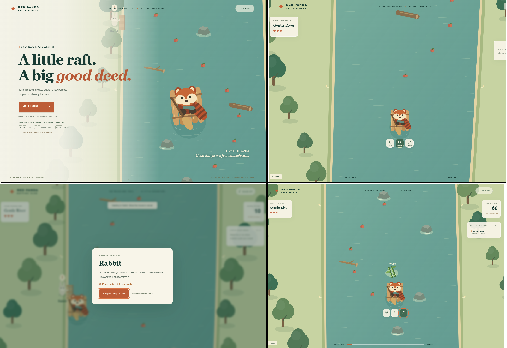

# Red Panda Rafting

A complete, authored woodland river game with mouse and keyboard controls. 
**Vibed this for my child, so don't expect anything other than a cozy simple game about their favourite animal!**

A normal run takes about ten minutes; paddling, braking and the river fork change travel time. Dialogue pauses the journey.




## Play

Open the root `index.html` directly in your browser. It contains the complete built game, including its styling and JavaScript. No server or installation is needed. You can also serve this file from any subfolder on a static website.

## Develop locally

Requires Node.js 22.20 or newer with npm.

```sh
npm ci
npm run dev
```

Open the local address printed by Vite. Edit `src/index.html` for HTML changes. `npm run build` creates a standalone game in both `dist/index.html` and the root `index.html`; `npm run preview` serves that build. The root HTML is generated, so make changes in `src` and rebuild. No backend, account or game network connection is required.

### Build and share

```sh
npm run build
```

Either generated HTML file can be shared on its own or hosted in a website subfolder. The build embeds all game JavaScript and CSS; the extra files under `dist/assets/` are not required by the standalone HTML.

Do not edit the root `index.html` or `dist/` by hand: the next build overwrites them. If the page appears as plain text with no game, make sure you opened the built root HTML. `src/index.html` must be served through Vite.

### GitHub Pages

The workflow in `.github/workflows/pages.yml` tests, builds, and deploys the game whenever changes are pushed to `main`. It can also be started manually from the repository's Actions tab.

One-time setup: in **Settings → Pages → Build and deployment**, choose **GitHub Actions** as the source. Pages for a private repository requires an eligible GitHub plan. The published game is a website; repository visibility and website visibility are separate settings.

Once deployment succeeds, the game is available at:

**https://ryerac.github.io/Red-Panda-Rafting/**

Only the standalone game HTML and a `.nojekyll` marker are uploaded. The game includes its compiled JavaScript and CSS, so it needs no server runtime or separately hosted assets. Future source changes become live after the deployment workflow succeeds. Check the Actions tab for build or deployment errors.

## Controls

- Mouse movement: steer left and right.
- Click an animal: approach its landing and dock automatically. Move again to cancel. A hand cursor and glowing dashed ring highlight the animal's clickable area.
- Floating buttons behind the raft: choose Slow, Normal, or Paddle, using icons with text labels.
- Click nearby lost items to retrieve them, and dialogue buttons to accept or decline.
- Left / right: steer (arrow keys take over from the mouse)
- Up / down: paddle / brake (the current keeps moving)
- Space: dock, retrieve a lost object, or decline dialogue
- Enter: accept or complete a task
- Escape: pause / resume
- Sound button: enable or mute ambience, music and effects

Collect berries on contact. Watch for shore markers. Carry up to three tasks; rescue passengers appear on the raft. The left fork visits Frog, while the right fork grants a risk bonus. Missed destinations reset your task streak. Every third collision carries the raft to a safe bank and restores hearts, costing up to 150 points. Brief immunity prevents repeated damage. Tasks remain aboard after recovery. The finish shows a score breakdown and stores your best score locally when storage is available.

Collect floating green bamboo on contact for **30 seconds of 50% extra speed**. A countdown appears at the top centre of the screen. Another bamboo pickup refreshes the duration without stacking speed. Pausing, dialogue, and recovery freeze the timer; braking still works while boosted.

## Content and implementation

| File | Purpose |
| --- | --- |
| `src/index.html` | Source menus, HUD, dialogue, pause, and results markup |
| `src/style.css` | Interface layout, typography, and colours |
| `src/main.ts` | Canvas artwork, movement, collisions, input, docking, audio, and game flow |
| `src/model.ts` | Tasks, run state, scoring, route boundaries, and content validation |
| `src/river-layout.json` | Predefined obstacle and berry placements |
| `scripts/build.mjs` | Packages the standalone HTML files |
| `vite.config.ts` | Development root and build settings |
| `tests/model.test.ts` | Gameplay-state tests |
| `e2e/game.spec.ts` | Browser journey and interaction tests |
| `e2e/mouse.spec.ts` | Hover feedback, floating pace controls, mouse docking, and dialogue |
| `e2e/bamboo.spec.ts` | Bamboo collection, countdown, pause, and expiry checks |
| `e2e/packaging.spec.ts` | Direct-file and static-subfolder checks |
| `design.md` | Product and creative direction |

Scenery uses original Canvas drawing code rather than image assets. The interface uses HTML/CSS and system font fallbacks. Audio is synthesised in the browser. All gameplay content is predefined.

## Check changes

```sh
npm test
npm run build
npx playwright install chromium
npx playwright test
```

`npm test` checks content, task limits, collections, rewards, failure and collision recovery. `npm run build` also checks TypeScript. Desktop mouse and keyboard play are supported; touch controls and controller input are future work.

Browser checks: run `npx playwright install chromium` once, then `npx playwright test`. These exercise docking, delivery, pause, a full journey and restart. Screenshots are written to `test-results`.

Browser tests currently use Chromium; they do not establish full cross-browser coverage. After building, `npx playwright test e2e/packaging.spec.ts` checks standalone distribution specifically. Manual playtesting is still needed for movement feel, all four task types, both fork routes, sound, and different window sizes.

## Updating the game

1. Record the intended player experience or rule change in [design.md](design.md). Separate implemented behaviour from future proposals.
2. Edit task definitions in `src/model.ts`, placements in `src/river-layout.json`, or the relevant gameplay and presentation code.
3. Check downstream reachability, safe bank access, fork requirements, and the three-task limit. Collection tasks need enough reachable berries after acceptance.
4. Run the relevant checks and play the affected river section.
5. Rebuild the standalone HTML and update this README if setup, controls, or distribution change.

Development requires Node and dependencies; the finished game does not. Sound starts muted. Touch and controller input are future work.


Agents: See [design.md](design.md) for the overall look, feel, goals, gameplay rules, and future direction.